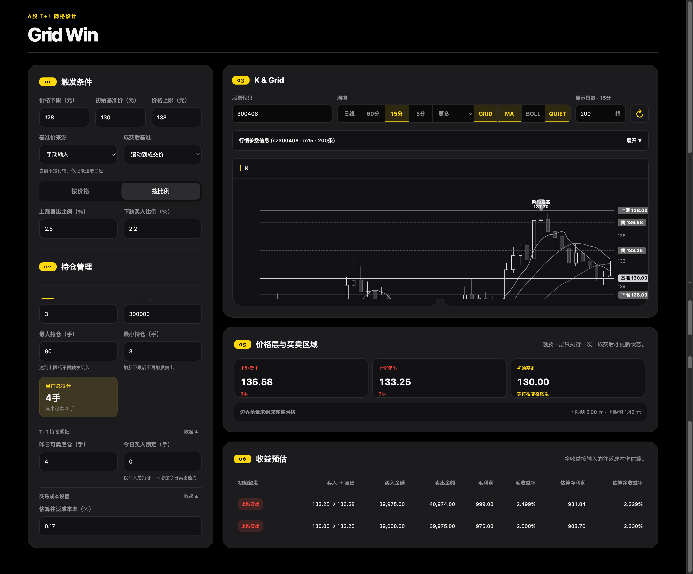

# Grid Win



面向 A 股 T+1 规则的网格策略规划与行情观察工具。它用于把价格区间、资金、持仓和网格间距转成可执行的价格层与承受力测算；不连接券商，也不会自动下单。

## 当前能力

- 价格网格：支持按固定价格或按比例生成上下网格。
- A 股 T+1：区分昨日可卖底仓与今日买入锁定仓位。
- 仓位约束：最大持仓限制后续买入，最小持仓限制后续卖出。
- 承受力：计算连续下跌可买格数、连续上涨可卖格数，以及资金/仓位限制原因。
- 收益预估：输出每格买入金额、卖出金额、毛利润、毛收益率和估算净收益。
- 腾讯财经行情：独立请求 K 线，并计算 MA、BOLL、RSI 技术指标。
- 图表视图：可分别开关 `GRID`、`MA`、`BOLL` 与 `QUIET`。
- 低调模式：`QUIET` 默认开启，使用灰阶 K 线与低饱和指标；关闭后恢复红绿和彩色指标。

## 快速启动

环境要求：Node.js 22.13 或更高版本。

```bash
npm install
npm run dev
```

开发服务会输出本地访问地址。若希望使用固定的生产预览端口：

```bash
npm run build
PORT=3002 npm run start
```

页面地址：`http://localhost:3002/calculator`

## 使用方式

### 1. 填写策略参数

页面首次打开时，策略数值字段均为空。填写完成后才会生成策略概览、行情推演、价格层和收益预估。

核心参数：

- 价格下限、初始基准价、价格上限。
- 上涨卖出与下跌买入的价差或比例。
- 每格交易手数、可用现金。
- 昨日可卖底仓、今日买入锁定仓位。
- 估算往返成本率。

可选参数：

- 最大持仓：达到上限后停止新的买入。
- 最小持仓：触及下限后停止新的卖出。

普通 A 股按每手 100 股计算。若最大持仓低于当前总持仓，连续下跌的买入承受力会显示为 0 格；这表示仓位上限限制，而不是现金不足。

### 2. 查看行情

`K & Grid` 默认加载 `300408` 的 15 分钟 K 线和 120 根数据。可切换：

- 日线、60 分、15 分、5 分。
- 更多：周线、月线、1 分钟、30 分钟。

切换周期会立即重新拉取数据。可直接修改股票代码并按 Enter，或点击刷新图标请求最新数据。

### 3. 控制图表信息密度

- `GRID`：显示/隐藏策略的上限、下限、基准与买卖网格线。
- `MA`：显示/隐藏 MA5、MA10、MA20、MA60。
- `BOLL`：显示/隐藏 BOLL 上、中、下轨；启用后悬浮提示也会显示三轨数值。
- `QUIET`：低调灰阶视图。关闭后恢复普通红涨绿跌和彩色指标。

图中会直接标出阶段最高与阶段最低价。悬浮十字光标可查看开、高、低、收和已启用指标的数值。

## 页面结构

| 编号 | 区域 | 内容 |
|---:|---|---|
| 01 | 触发条件 | 区间、基准、成交后基准和网格间距 |
| 02 | 持仓管理 | 资金、持仓上下限、T+1 明细、成本设置 |
| 03 | K & Grid | 腾讯 K 线与图表视图控制 |
| 04 | 行情推演 | 策略概览、连续上涨/下跌的承受力 |
| 05 | 价格层与买卖区域 | 完整网格价格层；最多显示 3 行，超出可内部滚动 |
| 06 | 收益预估 | 每格金额与收益；最多显示 10 行，超出可内部滚动 |

K 线技术指标明细默认折叠，按时间倒序显示，最多展示 10 行。

## 网格计算口径

设价格下限为 `L`、上限为 `U`、初始基准价为 `B`。

### 固定价格模式

```text
上涨卖出层：B + k × 卖出价差
下跌买入层：B - k × 买入价差
```

只保留价格在 `[L, U]` 内的完整层级。`N` 个完整网格对应 `N + 1` 条价格线；边界不足一个步长的部分单独列为余量，不计入完整网格。

### 比例模式

```text
上涨卖出层：B × (1 + 卖出比例 / 100)^k
下跌买入层：B × (1 - 买入比例 / 100)^k
```

价格统一按 0.01 元取整，避免生成重复价格层。

### 每格金额与收益

```text
交易股数 = 每格手数 × 100
买入金额 = 买入价 × 交易股数
卖出金额 = 卖出价 × 交易股数
毛利润 = (卖出价 - 买入价) × 交易股数
估算净利润 = 毛利润 - 买入金额 × 往返成本率
```

## T+1 与承受力口径

- 连续下跌：按从基准向下的买入格逐一扣减可用现金，同时受最大持仓限制。
- 连续上涨：按从基准向上的卖出格逐一扣减昨日可卖底仓，同时受最小持仓限制。
- 今日买入锁定仓位计入总持仓，但不增加当日可卖数量。
- 承受力中的“0/N 格”必须结合提示判断原因：可能是现金不足，也可能是最大持仓已到上限。

## 数据接口

前端只请求本项目 API，由 API 层访问腾讯财经并规范化为统一结构：

```text
GET /api/market/kline?stock_code=300408&k_type=m15&num=120
```

参数：

- `stock_code`：股票代码，支持 `300408`、`sz300408`、`sh600000` 等形式。
- `k_type`：`day`、`week`、`month`、`m1`、`m5`、`m15`、`m30`、`m60`。
- `num`：K 线数量；分钟周期最多 320 根，其他周期最多 640 根。

返回数据包括 OHLC、成交量、MA、BOLL 和 RSI。接口有短缓存，实际数据的时效性、复权口径和可用性以腾讯财经返回为准。

## 主要文件

```text
app/calculator/page.tsx          策略参数、网格与承受力计算、结果区域
app/components/market-panel.tsx  行情请求、ECharts K 线、指标与视图开关
app/lib/tencent-technical.ts     腾讯数据解析与 MA/BOLL/RSI 计算
app/api/market/kline/route.ts    K 线 API 路由
app/globals.css                  页面与图表周边样式
```

## 校验与构建

```bash
npm run lint
npm run build
npm test
```

## 边界说明

- 本工具用于策略规划与数据观察，不构成投资建议。
- 价格触及网格不等于订单成交；涨跌停、跳空、流动性、滑点和条件单延迟均可能影响执行结果。
- 当前没有券商连接、账户资产同步、真实订单管理或自动下单能力。
